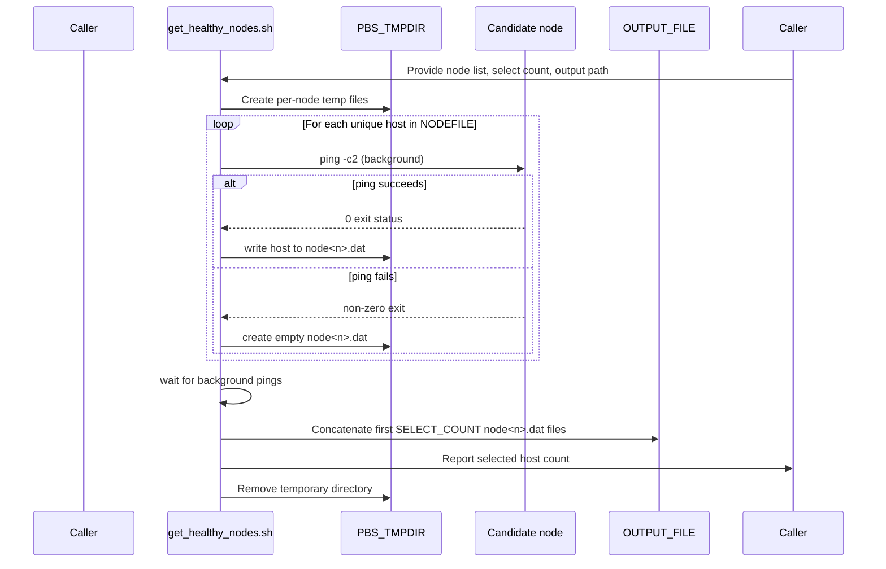
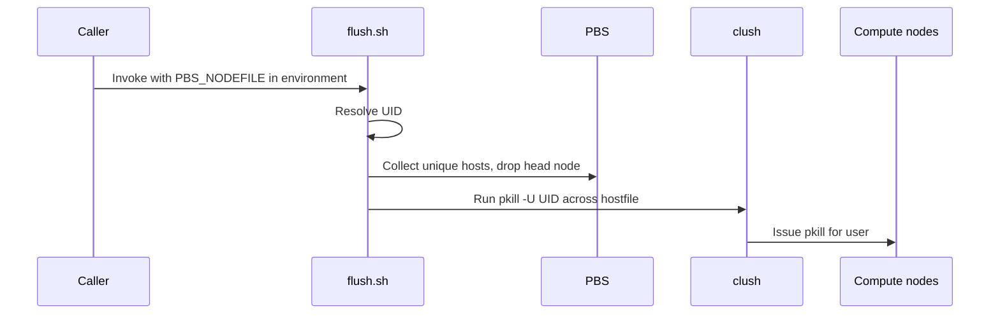
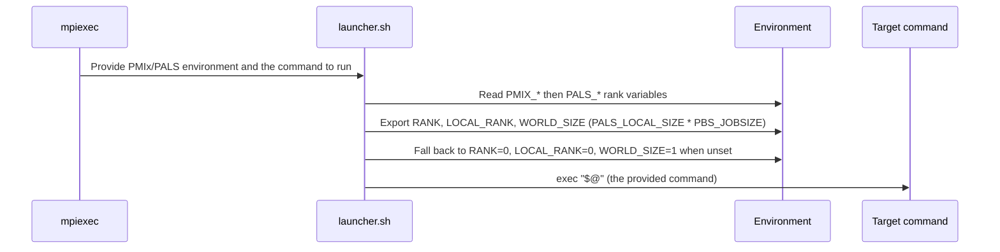
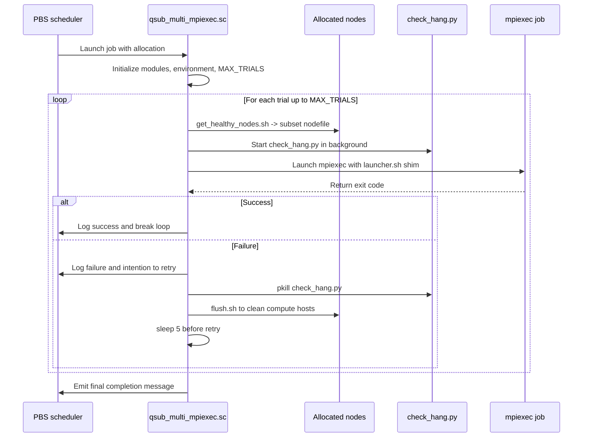

# Shell script logic reference

This document summarizes the orchestration logic used by the shell utilities that ship with the
checkpoint/restart examples.  Each section provides a narrative description and a Mermaid sequence
diagram so that the interactions between commands, files, and cluster services can be understood at a
glance.

## `get_healthy_nodes.sh`

`get_healthy_nodes.sh NODEFILE SELECT_COUNT OUTPUT_FILE` (in `utils/`) inspects the allocation that PBS provides and
builds a node file containing only the first `SELECT_COUNT` responsive hosts.  The script launches
parallel `ping` checks, records healthy nodes, and concatenates the requested number of results.

### Flow of control

## `flush.sh`

`flush.sh` (in `utils/`) cleans residual user processes across the nodes of a job.  The first node in
`$PBS_NODEFILE` is considered the head node and is skipped; all other unique nodes receive a `pkill`
call that targets the current user ID.

### Flow of control

## `launcher.sh`

`launcher.sh` (in `utils/`) is a thin MPI rank shim. It reads the per-rank environment that PALS/PMIx
exports on Aurora — falling back to PMIx values first, then overriding with PALS values — and exports
`RANK`, `LOCAL_RANK`, and `WORLD_SIZE` for the application. `WORLD_SIZE` is computed as
`PALS_LOCAL_SIZE * PBS_JOBSIZE` (unique nodes in `$PBS_NODEFILE`). If any of these variables are unset,
it falls back to `RANK=0`, `LOCAL_RANK=0`, `WORLD_SIZE=1`. It then execs the command passed on its
command line (`$@`). It does **not** set `MASTER_ADDR`/`MASTER_PORT`.

### Flow of control

## `qsub_multi_mpiexec.sc`

`qsub_multi_mpiexec.sc` is a PBS submission script that reruns a failing MPI workload inside the same
allocation until it succeeds or the trial limit is reached.

### Flow of control

