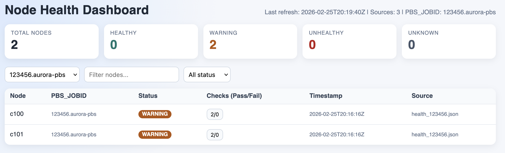

# System Monitoring

## Health Check Runner

- Script: `run_health_checks.py`
- Config: `health_checks.yaml`
- Purpose: build and run microkernel-based health checks.

Example:
```bash
python system_monitoring/run_health_checks.py --build
```

Export dashboard JSON from a run:
```bash
python system_monitoring/run_health_checks.py \
  --build \
  --dashboard-json system_monitoring/data/health_{job_id}.json \
  --pbs-jobid "$PBS_JOBID" \
  --nodefile "$PBS_NODEFILE"
```

`--nodefile` (defaults to `$PBS_NODEFILE`) makes the output include one node record per host in the nodefile, each with `status` / `health_condition`.

By default, writing is append/upsert by `(PBS_JOBID, node)`.
If `--dashboard-json` is omitted and `--pbs-jobid` is provided, output goes to `system_monitoring/data/health_<job_id>.json`.
Use `--overwrite-dashboard-json` if you want to replace the file content with only the current run.

## Dashboard (Initial Version)

- Script: `dashboard.py`
- Purpose: serve a simple HTTP dashboard that reads health JSON files and visualizes per-node status.
- UI includes a `PBS_JOBID` selector to filter displayed nodes per job.

### Start the dashboard

```bash
python system_monitoring/dashboard.py --data-dir system_monitoring/data --host 127.0.0.1 --port 8080
```

Then open `http://127.0.0.1:8080`.



The screenshot above shows the dashboard table with node name, `PBS_JOBID`, node status, and the clickable `Checks (Pass/Fail)` cell.
Clicking the checks cell opens a detail popup with exact passed and failed check names for that node.

### JSON input format

The loader accepts either:

1. a list of node records, or
2. an object with a `nodes` list.

Each record can include:

- `node` (or `hostname`/`host`/`name`)
- `PBS_JOBID` (or `pbs_jobid`/`job_id`/`jobid`/`job`) for job-level filtering
- `status` (`healthy`, `warning`, `unhealthy`, `unknown`) or `healthy: true|false`
- `timestamp` (ISO8601 recommended)
- any additional fields under `details`

Sample file pattern: `system_monitoring/data/health_<job_id>.json`.

The dashboard table includes a per-node `Checks (Pass/Fail)` field derived from each node's check summary.
It also shows check names directly from:
- `summary.passed_check_names`
- `summary.failed_check_names`

### API endpoints

- `GET /api/health`: current summary and node table as JSON
- `GET /api/health?job_id=<PBS_JOBID>`: filtered view for one job id
- `GET /api/ping`: liveness probe

## Value-based health gating

A microkernel can exit 0 and still report an unhealthy machine: a node with
half its memory consumed, or a GPU tile running well below its peers, returns
success while the numbers say otherwise. An `expect:` block in
`health_checks.yaml` gates on the measured values themselves.

```yaml
- id: mem_and_gpu_row
  command: ["{build_dir}/mem_and_gpu_row", "--csv"]
  env:
    ZES_ENABLE_SYSMAN: "1"
  expect:
    - name: mem_available_mib
      column: mem_available_mib
      min: 65536
    - name: gpu_used_mib
      column: gpu_sysman_used_mib
      max: 4096
      missing_ok: true
    - name: gpu_devices
      column: gpu_core_devices
      min: 1
```

This is the rule as shipped. Earlier revisions located the value with a regex
that counted commas, for example
`'^[0-9-]+T[0-9:]+,[^,]*,[^,]*,[^,]*,([0-9]+)'` for field 5. That form still
works and is documented below for non-CSV output, but it is the wrong tool for
a CSV column: inserting a field upstream moves the value being gated without
any error, and the rule for `gpu_sysman_used_mib` needed `(?:,[^,]*){16}` to
reach field 18, which nobody can be expected to write or review correctly.

### Naming a CSV column

Most health-check kernels print a CSV header naming every field. A rule that
gates one of those fields names the column directly:

```yaml
expect:
  - name: mem_available_mib
    column: mem_available_mib
    min: 65536
  - name: gpu_used_mib
    column: gpu_sysman_used_mib
    max: 4096
    missing_ok: true
```

Run the kernel to see the available names:

```bash
./build/health_checks/mem_and_gpu_row --csv | head -1 | tr ',' '\n'
```

The value is located by name, so inserting a column upstream cannot silently
change which number is gated. A column name that matches nothing fails the
check rather than passing quietly; use `missing_ok: true` where absence is
legitimate.

### Matching with a regex

For output that is not CSV, `pattern:` extracts the first capture group:

```yaml
expect:
  - name: dgemm_gflops
    pattern: 'DGEMM: ([0-9.eE+-]+) GFlop/s'
    min: 10000
```

Patterns are applied with `re.MULTILINE`, so `^` anchors to any output line.
A rule sets either `column:` or `pattern:`, never both.

Prefer `column:` for CSV. A positional regex such as

```
'^[0-9]{4}-[0-9]{2}-[0-9]{2}T[0-9:]+,[^,]+(?:,[0-9]+){15},([0-9]+),'
```

encodes the field index by counting commas, and the accompanying comment
naming the field number goes stale without any error when the format changes.

### Rule fields

| field | meaning |
|---|---|
| `name` | label for the measurement in output and dashboard JSON |
| `pattern` | regex with one capture group holding the number |
| `min` | optional lower bound; the check fails below it |
| `max` | optional upper bound; the check fails above it |
| `missing_ok` | when true, a pattern that matches nothing is not a failure |
| `occurrence` | which match to use: `first`, `last`, `min` or `max` |

Patterns are matched with `re.MULTILINE`, so `^` anchors to the start of any
line rather than the start of the whole output.

### The three levels

| YAML | behaviour |
|---|---|
| no `expect:` | exit code only |
| `expect:` without `min`/`max` | record-only: measured and trended, never fails |
| `expect:` with `min`/`max` | gates the check |

`min` and `max` are each optional. Omitting both makes the rule record-only,
which is how a threshold is acquired when its correct value is not yet known:
run it across a real allocation, read the values back from the dashboard JSON,
then set a bound.

### Failure semantics

- A pattern that matches nothing **fails** the check by default. A kernel that
  has gone silent is a real fault, not a missing measurement. Set
  `missing_ok: true` to opt out.
- Thresholds are only evaluated when the command exited 0. A non-zero exit is
  already a failure and its stdout is not trusted.

Recorded values appear in the run summary and in the dashboard JSON:

```
PASS mem_and_gpu_row   rc=  0 elapsed=0.07s  mem_available_mib=1143030 gpu_used_mib=0
```

## Kernel wall time

Every microkernel prints one line just before it exits:

```
KERNEL_TIME <name> <seconds> s
```

MPI kernels print from rank 0 only, so the line count is a cheap assertion that
the kernel reached its exit path. Measured on two Aurora nodes:

| kernel | 12 ranks | 24 ranks |
|---|---|---|
| mem_and_gpu_row | 0.045 s | - |
| topology | 0.039 s | - |
| triad | 3.29 s | 3.42 s |
| flops | 2.71 s | 2.75 s |
| pci | 27.58 s | - |
| peer2pear | 1.53 s | - |
| gemm | 31.43 s | 31.88 s |
| fftc2c | 17.13 s | - |
| simple_injection_bisection | 0.93 s | 0.99 s |
| full_injection_bisection | 0.90 s | - |

Note for anyone parsing kernel output: `KERNEL_TIME` is the last line a kernel
writes. Scripts that extracted a data row with `tail -1` must select by shape
instead, for example `grep -E '^[0-9]{4}-[0-9]{2}-[0-9]{2}T' | tail -1` for a
CSV row.


### GPU columns require Sysman

`mem_and_gpu_row` reports GPU memory through two paths. The Sysman path
(`gpu_sysman_*`) is the only one that reports memory *in use*, and it requires
`ZES_ENABLE_SYSMAN=1`. On Aurora those columns read zero on a healthy node even
with the variable set (job 8763307), so a threshold on `gpu_sysman_used_mib`
reports OK because it measured nothing, not because the node is clean. The rule
is kept for sites where Sysman works; on Aurora it is not a working check.

The shipped configuration sets the variable in the check's `env:` block and
also gates on `gpu_core_devices`, which does not depend on Sysman:

```yaml
env:
  ZES_ENABLE_SYSMAN: "1"
expect:
  - name: gpu_used_mib
    column: gpu_sysman_used_mib
    max: 4096
    missing_ok: true
  - name: gpu_devices
    column: gpu_core_devices
    min: 1
```

When adding a rule, confirm it can fail. Run the check somewhere the condition
is genuinely violated and verify a FAIL. A threshold that has never been
observed to fire has not been tested.
